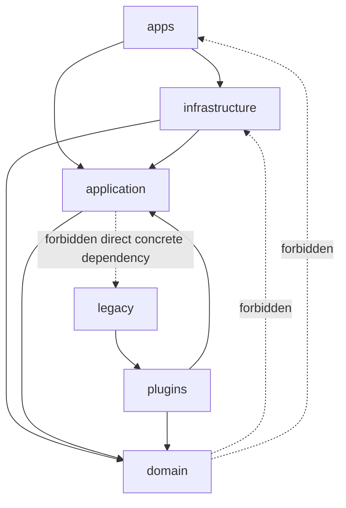
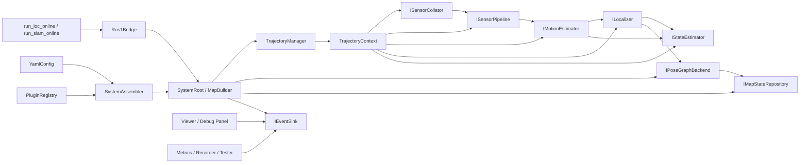
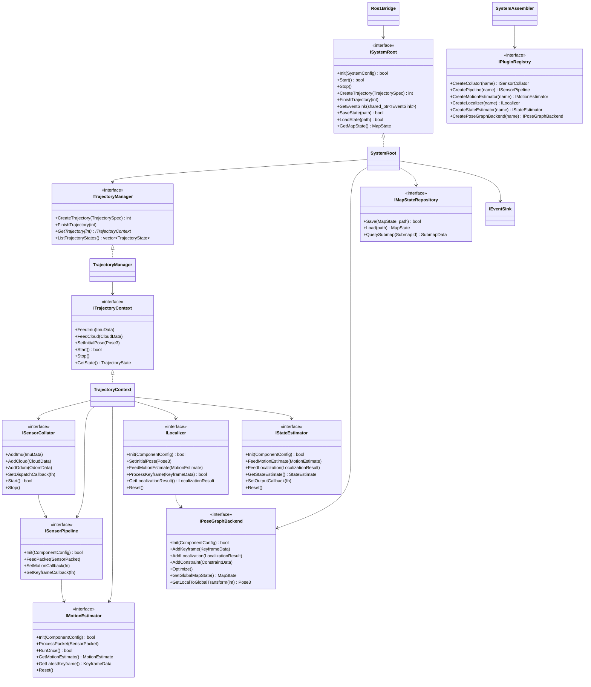
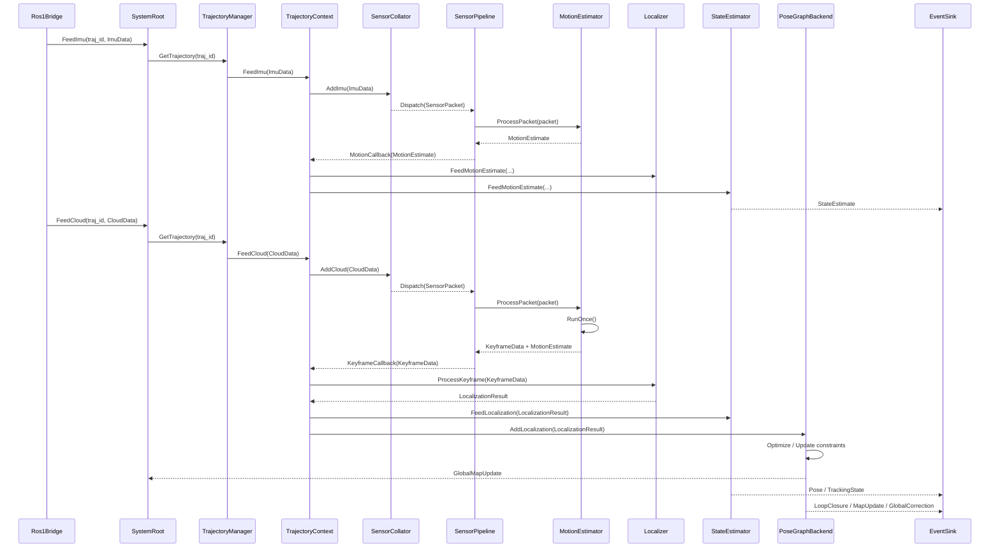

```mermaid
flowchart TD
    Apps[apps]
    Infra[infrastructure]
    App[application]
    Domain[domain]
    Plugins[plugins]
    Legacy[legacy]

    Apps --> Infra
    Apps --> App
    Infra --> App
    Infra --> Domain
    App --> Domain
    Plugins --> Domain
    Plugins --> App
    Legacy --> Plugins

    Domain -. forbidden .-> Infra
    Domain -. forbidden .-> Apps
    App -. forbidden direct concrete dependency .-> Legacy

```

```mermaid
flowchart LR
    App[run_loc_online / run_slam_online] --> Bridge[Ros1Bridge]
    Bridge --> System[SystemRoot / MapBuilder]

    Config[YamlConfig] --> Assembler[SystemAssembler]
    Registry[PluginRegistry] --> Assembler
    Assembler --> System

    System --> TrajMgr[TrajectoryManager]
    TrajMgr --> Traj[TrajectoryContext]

    Traj --> Collator[ISensorCollator]
    Traj --> Pipeline[ISensorPipeline]
    Traj --> Motion[IMotionEstimator]
    Traj --> Localizer[ILocalizer]
    Traj --> StateEstimator[IStateEstimator]

    System --> Backend[IPoseGraphBackend]
    System --> MapRepo[IMapStateRepository]
    System --> EventSink[IEventSink]

    UI[Viewer / Debug Panel] --> EventSink
    Monitor[Metrics / Recorder / Tester] --> EventSink

    Collator --> Pipeline
    Pipeline --> Motion
    Motion --> Localizer
    Motion --> StateEstimator
    Localizer --> StateEstimator
    Localizer --> Backend
    Backend --> MapRepo
```

```mermaid
classDiagram
    class ISystemRoot {
        <<interface>>
        +Init(SystemConfig) bool
        +Start() bool
        +Stop()
        +CreateTrajectory(TrajectorySpec) int
        +FinishTrajectory(int)
        +SetEventSink(shared_ptr~IEventSink~)
        +SaveState(path) bool
        +LoadState(path) bool
        +GetMapState() MapState
    }

    class ITrajectoryManager {
        <<interface>>
        +CreateTrajectory(TrajectorySpec) int
        +FinishTrajectory(int)
        +GetTrajectory(int) ITrajectoryContext*
        +ListTrajectoryStates() vector~TrajectoryState~
    }

    class ITrajectoryContext {
        <<interface>>
        +FeedImu(ImuData)
        +FeedCloud(CloudData)
        +SetInitialPose(Pose3)
        +Start() bool
        +Stop()
        +GetState() TrajectoryState
    }

    class ISensorCollator {
        <<interface>>
        +AddImu(ImuData)
        +AddCloud(CloudData)
        +AddOdom(OdomData)
        +SetDispatchCallback(fn)
        +Start() bool
        +Stop()
    }

    class ISensorPipeline {
        <<interface>>
        +Init(ComponentConfig) bool
        +FeedPacket(SensorPacket)
        +SetMotionCallback(fn)
        +SetKeyframeCallback(fn)
    }

    class IMotionEstimator {
        <<interface>>
        +Init(ComponentConfig) bool
        +ProcessPacket(SensorPacket)
        +RunOnce() bool
        +GetMotionEstimate() MotionEstimate
        +GetLatestKeyframe() KeyframeData
        +Reset()
    }

    class ILocalizer {
        <<interface>>
        +Init(ComponentConfig) bool
        +SetInitialPose(Pose3)
        +FeedMotionEstimate(MotionEstimate)
        +ProcessKeyframe(KeyframeData) bool
        +GetLocalizationResult() LocalizationResult
        +Reset()
    }

    class IStateEstimator {
        <<interface>>
        +Init(ComponentConfig) bool
        +FeedMotionEstimate(MotionEstimate)
        +FeedLocalization(LocalizationResult)
        +GetStateEstimate() StateEstimate
        +SetOutputCallback(fn)
        +Reset()
    }

    class IPoseGraphBackend {
        <<interface>>
        +Init(ComponentConfig) bool
        +AddKeyframe(KeyframeData)
        +AddLocalization(LocalizationResult)
        +AddConstraint(ConstraintData)
        +Optimize()
        +GetGlobalMapState() MapState
        +GetLocalToGlobalTransform(int) Pose3
    }

    class IMapStateRepository {
        <<interface>>
        +Save(MapState, path) bool
        +Load(path) MapState
        +QuerySubmap(SubmapId) SubmapData
    }

    class IPluginRegistry {
        <<interface>>
        +CreateCollator(name) ISensorCollator
        +CreatePipeline(name) ISensorPipeline
        +CreateMotionEstimator(name) IMotionEstimator
        +CreateLocalizer(name) ILocalizer
        +CreateStateEstimator(name) IStateEstimator
        +CreatePoseGraphBackend(name) IPoseGraphBackend
    }

    class SystemRoot
    class TrajectoryManager
    class TrajectoryContext
    class SystemAssembler
    class Ros1Bridge

    ISystemRoot <|.. SystemRoot
    ITrajectoryManager <|.. TrajectoryManager
    ITrajectoryContext <|.. TrajectoryContext

    SystemRoot --> ITrajectoryManager
    SystemRoot --> IPoseGraphBackend
    SystemRoot --> IMapStateRepository
    SystemRoot --> IEventSink

    TrajectoryManager --> ITrajectoryContext
    TrajectoryContext --> ISensorCollator
    TrajectoryContext --> ISensorPipeline
    TrajectoryContext --> IMotionEstimator
    TrajectoryContext --> ILocalizer
    TrajectoryContext --> IStateEstimator

    ISensorCollator --> ISensorPipeline
    ISensorPipeline --> IMotionEstimator
    ILocalizer --> IPoseGraphBackend

    SystemAssembler --> IPluginRegistry
    Ros1Bridge --> ISystemRoot
```

```mermaid
sequenceDiagram
    participant ROS as Ros1Bridge
    participant SYS as SystemRoot
    participant TM as TrajectoryManager
    participant TRJ as TrajectoryContext
    participant COL as SensorCollator
    participant PIP as SensorPipeline
    participant ME as MotionEstimator
    participant LOC as Localizer
    participant SE as StateEstimator
    participant PG as PoseGraphBackend
    participant EVT as EventSink

    ROS->>SYS: FeedImu(traj_id, ImuData)
    SYS->>TM: GetTrajectory(traj_id)
    TM->>TRJ: FeedImu(ImuData)
    TRJ->>COL: AddImu(ImuData)
    COL-->>PIP: Dispatch(SensorPacket)
    PIP->>ME: ProcessPacket(packet)
    ME-->>PIP: MotionEstimate
    PIP-->>TRJ: MotionCallback(MotionEstimate)
    TRJ->>LOC: FeedMotionEstimate(...)
    TRJ->>SE: FeedMotionEstimate(...)
    SE-->>EVT: StateEstimate

    ROS->>SYS: FeedCloud(traj_id, CloudData)
    SYS->>TM: GetTrajectory(traj_id)
    TM->>TRJ: FeedCloud(CloudData)
    TRJ->>COL: AddCloud(CloudData)
    COL-->>PIP: Dispatch(SensorPacket)
    PIP->>ME: ProcessPacket(packet)
    ME->>ME: RunOnce()
    ME-->>PIP: KeyframeData + MotionEstimate
    PIP-->>TRJ: KeyframeCallback(KeyframeData)

    TRJ->>LOC: ProcessKeyframe(KeyframeData)
    LOC-->>TRJ: LocalizationResult
    TRJ->>SE: FeedLocalization(LocalizationResult)
    TRJ->>PG: AddLocalization(LocalizationResult)
    PG->>PG: Optimize / Update constraints

    PG-->>SYS: GlobalMapUpdate
    SE-->>EVT: Pose / TrackingState
    PG-->>EVT: LoopClosure / MapUpdate / GlobalCorrection
```