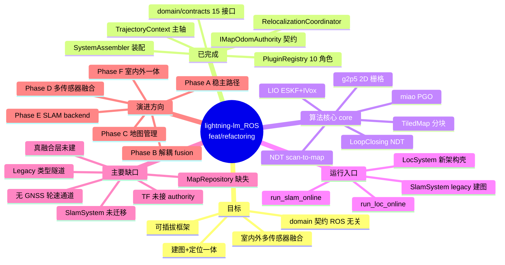
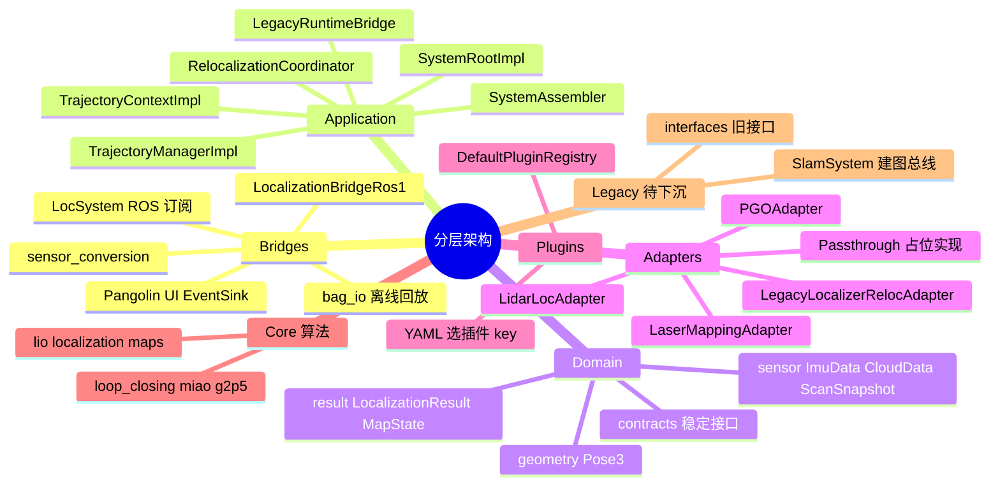
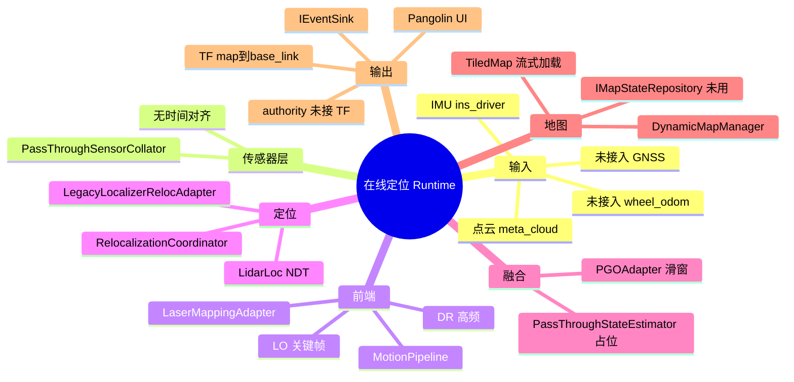
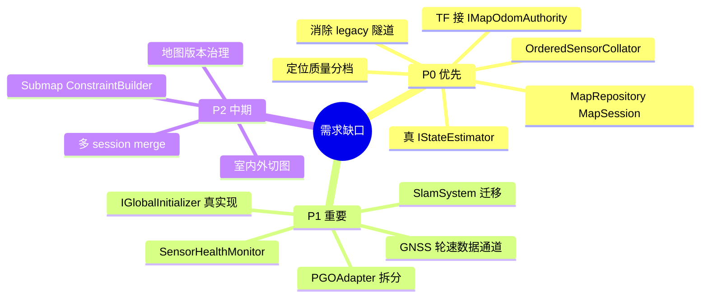
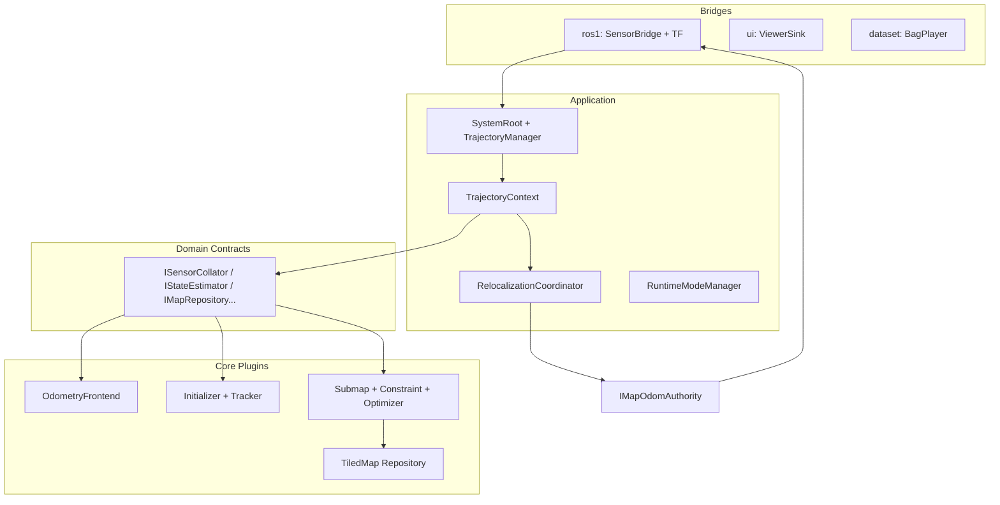
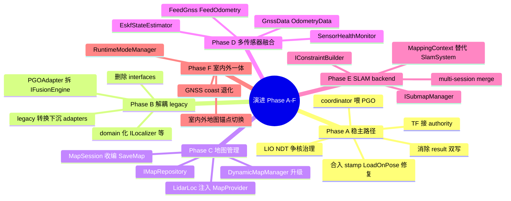

# 项目现状总览（feat/refactoring）

> 更新日期：2026-07-02  
> 分支：`feat/refactoring`  
> 目标：从零散算法工程演化为可插拔、高内聚、支持建图+定位+多传感器融合的 SLAM/定位框架。

---

## 1. 执行摘要

### 1.1 已做到什么

- **契约层**：`domain/contracts` 已建立 15 个 ROS 无关接口（`ISystemRoot`、`ITrajectoryContext`、`IGlobalInitializer`、`ILocalTracker`、`IMapOdomAuthority`、`IPoseGraphBackend` 等）。
- **装配层**：`SystemAssembler` + `DefaultPluginRegistry` 支持 YAML 驱动插件装配（10 个 `PluginRole`）。
- **运行主轴**：`SystemRootImpl` → `TrajectoryManagerImpl` → `TrajectoryContextImpl` 多轨迹运行时成立。
- **重定位主路径**：`RelocalizationCoordinator` 已接管 keyframe 定位链路，`IMapOdomAuthority` 为 map→odom 唯一更新者（契约层）。
- **算法核心**：Faster-LIO 系 ESKF+IVox 前端、NDT scan-to-map 定位、miao 滑窗 PGO、TiledMap 分块地图、NDT 多分辨率回环均已可用并经 adapter 接入。

### 1.2 最大瓶颈

1. **Legacy 隧道**：collator 之后立即转回 `IMUPtr/CloudPtr/NavState`，domain 契约与热路径实现脱节。
2. **map→odom 权威已接 TF**：`LegacyRuntimeBridge` 通过 `IMapOdomAuthority` 发 `map→odom`，`MotionEstimate` 发 `odom→base_link`（2026-07-02 Phase A）。
3. **传感器通路已通、融合未做**：GNSS/轮速已有 domain 通道进 `IStateEstimator`（2026-07-02 Sprint 3），但仍是 pass-through 记录，无融合算法。
4. **建图与定位双轨**：`SlamSystem` 绕过新架构；地图经离线工具与定位衔接。
5. **PGO 平滑未回写 UI/TF**：coordinator 发事件，PGO 仅内部消费（双写已消除）。

### 1.3 近期验证（yangpu/qc）

| 项目 | 结果 |
|------|------|
| 在线建图 50s | 通过（`run_slam_online` + qc bag） |
| 地图切块 | `map_0623-1730.pcd` → 73 chunks（`run_map_chunker`） |
| 在线定位 50s | 通过（INS 初值；`No point` 仅启动 2 次；NDT 置信度 1.3~2.6） |
| Phase A 单测 | `test_relocalization_main_path` 全部通过（含 Freeze / PGO feed / GNSS 通道） |
| TF 双链路 | bag 播放期间 `/tf` 同时发布 `map→odom` 与 `odom→base_link`（详见 [testing/phase_a_test_report.md](testing/phase_a_test_report.md)） |
| GNSS/轮速通道 | 通过（60s ≈6000 条 GNSS + ≈5500 条 INS 里程计进状态估计器） |
| 精度评估（60s 含运动段） | **不通过**：地图系与 INS 系错位 + QC 场景 LIO 运动后发散（详见 [testing/sprint3_accuracy_test_report.md](testing/sprint3_accuracy_test_report.md)） |
| 已修复 bug | `ToLegacyCloud` 未回填 `header.stamp`；外部初值未 `LoadOnPose` |

配置：`config/yangpu_qc.yaml`（meta_cloud + INS IMU + yangpu 地图路径）。

---

## 2. 项目思维导图（总览）



---

## 3. 分层架构思维导图



---

## 4. 目录结构与模块职责

```
src/
├── domain/
│   ├── contracts/     # 15 个稳定契约（ROS/算法无关）
│   ├── sensor/        # ImuData, CloudData, ScanSnapshot
│   ├── result/        # LocalizationResult, MapState, RelocalizationState...
│   └── geometry/      # Pose3
├── application/
│   ├── system/        # SystemRoot, Assembler, RelocalizationCoordinator, LegacyRuntimeBridge
│   └── trajectory/    # TrajectoryContextImpl, legacy 转换（待下沉）
├── adapters/          # legacy 算法 → domain 契约
├── plugins/registry/  # DefaultPluginRegistry
├── core/
│   ├── lio/           # Faster-LIO 系 LaserMapping + ESKF
│   ├── localization/  # lidar_loc, pose_graph/PGO
│   ├── maps/          # TiledMap
│   ├── loop_closing/
│   ├── miao/          # 图优化库
│   ├── g2p5/          # 2D 栅格（导航用）
│   └── system/        # SlamSystem, LocSystem
├── bridges/           # ROS1 桥接（实际 ROS 入口）
├── map_runtime/       # DynamicMapManager（LidarLoc 内部使用）
├── pipelines/         # MotionPipeline
├── app/               # 可执行入口
└── interfaces/        # legacy 兼容接口（计划废弃）
```

### 4.1 模块状态表

| 模块 | 关键类/文件 | Runtime 位置 | 建议 |
|------|------------|--------------|------|
| domain/contracts | `ISystemRoot`, `ITrajectoryContext`, `IGlobalInitializer`... | 稳定边界 | **保留** |
| SystemRootImpl | `application/system/system_root_impl.*` | 系统根 | **保留** |
| TrajectoryContextImpl | `application/trajectory/trajectory_context_impl.*` | 单轨迹编排 | **需重构**（减 legacy） |
| RelocalizationCoordinator | `application/system/relocalization_coordinator.*` | keyframe 主路径 | **保留** |
| LegacyRuntimeBridge | `application/system/legacy_runtime_bridge.*` | ROS↔domain + UI/TF | **下沉 adapter** |
| DefaultPluginRegistry | `plugins/registry/default_plugin_registry.*` | 工厂 | **保留** |
| LaserMappingAdapter | `adapters/laser_mapping_adapter.*` | LIO 前端 | **保留** |
| LidarLocAdapter | `adapters/lidar_loc_adapter.*` | NDT 定位 | **保留** |
| PGOAdapter | `adapters/pgo_adapter.*` | 滑窗 PGO | **拆分** IFusionEngine |
| LegacyLocalizerRelocAdapter | `adapters/legacy_localizer_relocalization_adapter.*` | Initialize/Track | **过渡**，待替换 |
| PassThrough* | collator/state_estimator/map_repo | 占位 | **替换为真实现** |
| SlamSystem | `core/system/slam.*` | legacy 建图 | **废弃**，迁 MappingContext |
| LocSystem | `core/system/loc_system.*` | ROS 定位入口 | **保留**为 bridge |
| TiledMap | `core/maps/tiled_map.*` | 地图存储 | **保留**，上提 MapRepository |
| interfaces/* | `interfaces/*.h` | legacy | **废弃** |

---

## 5. 运行时主路径

### 5.1 在线定位数据流（当前）

```text
LocSystem (ROS 订阅 IMU/点云)
  → LocalizationBridgeRos1
  → Localization (façade)
  → LegacyRuntimeBridge
  → SystemRootImpl::FeedImu / FeedCloud
  → TrajectoryContextImpl
  → PassThroughSensorCollator
  → MotionPipeline
  → LaserMappingAdapter (LIO/ESKF)
      ├─ DR/LO 回调 → LidarLoc + PassThroughStateEstimator + PGOAdapter
      └─ keyframe → localization_proc_cloud (异步)
            → RelocalizationCoordinator::ProcessScan
            → LegacyLocalizerRelocalizationAdapter
            → LidarLoc (NDT)
            → IMapOdomAuthority::UpdateFromLocalization
            → IEventSink::OnLocalizationResult
            → LegacyRuntimeBridge → TF (map→base_link) + UI
```

### 5.2 重定位主路径（契约语义）

详见 [relocalization_main_path.md](relocalization_main_path.md)。

```text
ScanSnapshot
  → RelocalizationCoordinator
  → IGlobalInitializer / ILocalTracker
  → IMapOdomAuthority
  → LocalizationResult 事件
```

状态机：`Idle` → `Accumulating` → `GlobalInitializing` → `Tracking`；失败 → `Lost`（可冻结 map→odom）。

### 5.3 建图路径（仍为 legacy）

```text
SlamSystem
  → LaserMapping (LIO)
  → Keyframe
  → LoopClosing + G2P5
  → SaveMap → TiledMap (index.txt + *.pcd)
```

建图与定位**未共用** `MapSession/MapState` 语义；定位侧通过 `system.map_path` 加载 TiledMap。

### 5.4 Runtime 思维导图



---

## 6. 插件装配（DefaultPluginRegistry）

| PluginRole | 默认 key | 实现 |
|------------|----------|------|
| kSensorCollator | `passthrough_sensor_collator` | 直通，无 collation |
| kSensorPipeline | `motion_pipeline` | `MotionPipeline` |
| kMotionEstimator | `laser_mapping_adapter` | `LaserMapping` |
| kLocalizer | `lidar_loc_adapter` | `LidarLoc` |
| kStateEstimator | `passthrough_state_estimator` | 简单合并，非真融合 |
| kPoseGraphBackend | `pgo_adapter` | `PGO` + miao |
| kMapStateRepository | `null_map_state_repository` | 内存 stub |
| kGlobalInitializer | `legacy_localizer_relocalization_adapter` | 包装 LidarLoc |
| kLocalTracker | `legacy_localizer_relocalization_adapter` | 同上 |
| kMapOdomAuthority | `passthrough_map_odom_authority` | map→odom 计算 |

装配入口：`SystemAssembler::AssembleLocalization()`（读 `yaml["system"]` 组件名）。

---

## 7. Domain 契约清单（稳定层）

| 契约 | 文件 | 职责 |
|------|------|------|
| `ISystemRoot` | `system_root.h` | Init/Start/Feed/EventSink |
| `ITrajectoryManager` | `trajectory_manager.h` | 多轨迹注册 |
| `ITrajectoryContext` | `trajectory_context.h` | 单轨迹生命周期与传感器入口 |
| `ISensorCollator` | `sensor_collator.h` | IMU/点云收集分发 |
| `IGlobalInitializer` | `global_initializer.h` | 全局 scan-to-map 初始化 |
| `ILocalTracker` | `local_tracker.h` | 局部连续跟踪 |
| `IMapOdomAuthority` | `map_odom_authority.h` | **唯一** map→odom 状态 |
| `IPoseGraphBackend` | `pose_graph_backend.h` | 图优化后端输入输出 |
| `IStateEstimator` | `state_estimator.h` | 高频状态融合（待真实现） |
| `IMapStateRepository` | `map_state_repository.h` | 地图元数据持久化（待真实现） |
| `IEventSink` | `event_sink.h` | 异步事件输出（含 UI/TF 桥） |
| `IPluginRegistry` | `plugin_registry.h` | 插件工厂 |

**过渡契约（using 转发 legacy）**：`ILocalizer`、`IMotionEstimator`、`ISensorPipeline` → `interfaces/`，计划替换为 domain-native 接口。

---

## 8. 算法与地图能力

| 能力 | 实现 | 说明 |
|------|------|------|
| LiDAR-Inertial Odometry | `LaserMapping` + `ESKF` + `IVox` | Faster-LIO 系，非 g2o/GTSAM |
| 定位匹配 | `LidarLoc` + pclomp NDT | scan-to-map；可选 ICP 微调 |
| 全局初始化 | FP + yaw 网格搜索 | 非 Scan Context / BnB |
| 后端优化 | `PGO` + `miao` | LidarLoc 先验 + LO 相对边；GNSS 因子未启用 |
| 回环 | `LoopClosing` | 距离候选 + 多分辨率 NDT + miao |
| 地图 | `TiledMap` | 100m 分块 PCD + NDT 体素 + 动态层 `_dyn.pcd` |
| 2D 导航图 | `G2P5` | 仅 SLAM 模式输出，不参与定位 |

---

## 9. 需求缺口（优先级）



| 缺口 | 现状 | 优先级 |
|------|------|--------|
| 传感器合流与时间同步 | PassThrough，无排序缓冲 | P0 |
| map→odom TF 权威 | 契约有，TF 未接 | P0 |
| MapRepository / MapSession | NullMapStateRepository；TiledMap 旁路 | P0 |
| 多传感器融合 | PGO 仅 Loc+LO；GNSS 未接入 | P0 |
| 建图统一架构 | SlamSystem 独立 | P1 |
| 子图/约束/回环抽象 | loop_closing 绑 SlamSystem | P1 |

---

## 10. 目标架构（1~2 年）

### 10.1 分层目标图



### 10.2 演进路线思维导图



| Phase | 周期 | 验收要点 |
|-------|------|----------|
| A | 2–3 周 | yangpu 1x 实时率 50s 不发散；Lost 时 map→odom 冻结 |
| B | 3–4 周 | application 层无 `interfaces/` include |
| C | 4–6 周 | 建图→定位不出程序完成；MapState 带 version |
| D | 6–8 周 | GNSS 掐断 30s 连续输出 + health 事件 |
| E | 8–12 周 | 双 session merge 接缝 < 0.2m |
| F | 4–6 周 | 室内外切换位姿连续 |

---

## 11. 外部参考借鉴要点

### 11.1 FusionCore（UKF 松耦合融合）

**可借鉴**：core/ROS 分离、SensorHealth、chi2 门控、自适应 R、GNSS coast/recovery、延迟补偿（快照+IMU 重放）、测量函数分文件组织。

**落地位置**：`IStateEstimator` 插件实现层（如 `ukf_state_estimator`），**不**进 domain 契约具体维度。

**不宜迁移**：23 维 UKF 状态写死进契约；ROS2 lifecycle 实现。

### 11.2 Cartographer（架构思想）

**可借鉴**：Collator 时间合流、Local/Global SLAM 职责分离、Submap 双活跃+冻结生命周期、ConstraintBuilder 与检测分离、纯定位=frozen map + trimmer。

**落地位置**：`OrderedSensorCollator`、`ISubmapManager`、`IConstraintBuilder`；地图表示继续用 TiledMap，不引入概率栅格子图。

**不宜迁移**：Ceres/pbstream/lua 配置；Cartographer 命名写入契约。

---

## 12. 推荐下一步（工程优先级）

1. **TF 接 `IMapOdomAuthority`**（map→odom + odom→base_link 分解发布）；coordinator 成功路径补喂 PGO。
2. **打通 GNSS/轮速 domain 类型与 Feed 通道**（yangpu 数据现成，先通路后融合）。
3. **单独提交已修复的两个在线定位 bug**（`ToLegacyCloud` stamp、`LoadOnPose` 前加载地图块）。

相关架构细节见 [backend_decoupling.md](backend_decoupling.md)。

---

## 13. 测试与配置

### 13.1 yangpu/qc 数据特征

| 话题 | 类型 | 坐标系/说明 |
|------|------|-------------|
| `/lidar_preprocessor/meta_cloud` | PointCloud2 | base_link，已合并去畸变 |
| `/ins_driver/imu` | Imu | chcnav 轴系，acc 单位 g |
| `/localization/ins` | Odometry | frame=map，位姿有效 |
| `/ins_driver/gps` | NavSatFix | 经纬度 |
| `/wheel_odom` | Odometry | 轮速里程计 |

### 13.2 推荐命令

```bash
# 编译
cd ~/proj/lightning-lm_ROS1_ws && catkin_make

# 地图切块
run_map_chunker --input_pcd /path/to/map.pcd --output_dir /path/to/chunked

# 在线定位（需 roscore + bag play）
run_loc_online --config config/yangpu_qc.yaml \
  --init_x 238.74 --init_y -208.92 --init_z 0.07 \
  --init_qx 0.00806 --init_qy -0.00054 --init_qz 0.90942 --init_qw -0.41581

rosbag play -u 50 bag0.bag bag1.bag
```

### 13.3 已知限制

- 实时率 1x 播放时，NDT 初始化搜索与 LIO 争 CPU 可能导致短时 LIO 发散；0.5x 稳定。
- 港口场景地图与数据日期间隔大时，需调低 `min_init_confidence`（yangpu 实测约 0.5）。
- TF 当前为 map→base_link，与目标 map→odom + odom→base_link 不一致。

---

## 14. 相关文档

- [重定位主路径](relocalization_main_path.md)
- [Backend 解耦](backend_decoupling.md)
- [文档索引](../README.md)
