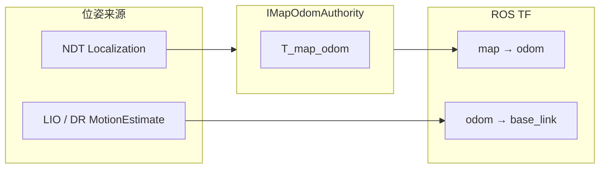

# Phase A 开发记录：TF 接 IMapOdomAuthority

> 日期：2026-07-02  
> 分支：`feat/refactoring`  
> 对应计划：Sprint 0（在线定位 bug 修复）+ Sprint 1（TF 权威）+ Sprint 2（NDT 初始化限流）

---

## 1. 目标

1. **Sprint 0**：修复 yangpu/qc 在线定位两个阻塞 bug（已在本轮一并保留）。
2. **Sprint 1**：TF 由 `IMapOdomAuthority` 发布 `map→odom`，由 LIO/DR 发布 `odom→base_link`；coordinator 成功路径补喂 PGO；消除 PGO 与 coordinator 对 localization 事件的双写。
3. **Sprint 2**：限制 NDT 初始化 yaw 搜索候选数，减轻与 LIO 争核。

---

## 2. 变更摘要

### 2.1 Sprint 0 — 在线定位稳定性（沿用既有修复）

| 文件 | 改动 |
|------|------|
| `trajectory_legacy_conversion.cc` | `ToLegacyCloud` 回填 `cloud->header.stamp`，恢复 LIO 的 IMU/点云时间同步 |
| `lidar_loc.cc` | 外部初值 `InitWithFP` 前 `LoadOnPose` + `RebuildTargetIfNeeded` |
| `run_loc_online.cc` | 增加 `--init_x/y/z/qx/qy/qz/qw` 命令行初值 |
| `config/yangpu_qc.yaml` | yangpu meta_cloud + INS IMU + 切块地图测试配置 |

### 2.2 Sprint 1 — TF 双链路与事件去重

**新增**

- `src/bridges/tf_conversion.h/.cc`：`domain::geometry::Pose3` → `geometry_msgs::TransformStamped`（ROS 类型仅限 bridges 层）

**`LegacyRuntimeBridge`**

- Init 完成后从 `SystemRootImpl::GetMapOdomAuthority()` 获取权威实例
- `OnMotionEstimate` 缓存最新 `odom→base_link` 位姿
- `PublishSplitTf()`：发布 `map→odom`（authority）+ `odom→base_link`（motion）
- 不再调用 `LocalizationResult::ToGeoMsg()` 发 `map→base_link`

**`SystemRootImpl`**

- 装配时保存 `LocalizationAssembly::map_odom_authority`
- 新增 `GetMapOdomAuthority()` 供 bridge 使用

**`TrajectoryContextImpl`**

- coordinator 成功：`FeedLocalizationToBackends(nullptr, result, false)` 补喂 PGO
- legacy fallback：`HandleLocalizationResult(..., true)` 统一由主路径发事件；`FeedLocalizationToBackends(..., false)` 避免二次发布
- PGO `SetOutputCallback` 仅更新 `latest_localization_result_`，不再 `OnLocalizationResult` 双写

### 2.3 Sprint 2 — NDT 初始化限流（**已于 Sprint 3 回退**）

| 文件 | 改动 |
|------|------|
| `lidar_loc.cc` | ~~`YawSearch` 将 yaw 候选数上限为 24~~ 已回退：15° 角分辨率超出 NDT 收敛域，导致外部初值初始化失败（见 [Sprint 3 开发记录](sprint3_sensor_channels.md) 第 3 节） |

---

## 3. 运行时 TF 语义（变更后）



- **map→odom**：仅由 `PassthroughMapOdomAuthority::UpdateFromLocalization` 更新；`Freeze()` 后保持不变。
- **odom→base_link**：来自最新有效 `MotionEstimate`（LIO 或 DR），与定位频率解耦。
- **合成关系**：`T_map_base = T_map_odom * T_odom_base`（与 Cartographer / FusionCore 惯例一致）。

---

## 4. 数据流（coordinator 主路径）

```
KeyframeScan
  → RelocalizationCoordinator::ProcessScan
  → IMapOdomAuthority::UpdateFromLocalization
  → HandleLocalizationResult (事件/UI 一次)
  → FeedLocalizationToBackends → IPoseGraphBackend (无二次事件)
  → OnMotionEstimate → PublishSplitTf (高频 odom→base)
```

---

## 5. 验证

### 5.1 单元测试

```bash
cd ~/proj/lightning-lm_ROS1_ws
catkin_make
./devel/lib/lightning/test_relocalization_main_path
```

新增/加强断言：

- coordinator 路径 `pose_graph_backend` 收到 localization
- `TestMapOdomAuthorityFreeze`：`Freeze()` 后 `GetMapToOdom()` 不变
- legacy + PGO 路径：事件 sink 仅 1 次 localization 事件

### 5.2 集成（yangpu/qc）

```bash
# 终端 1
roscore

# 终端 2
rosrun lightning run_loc_online \
  --config /path/to/yangpu_qc.yaml \
  --init_x 238.74 --init_y -208.92 --init_z 0.07 \
  --init_qx 0 --init_qy 0 --init_qz 0 --init_qw 1

# 终端 3（建议 0.5x 首跑）
rosbag play -r 0.5 -u 50 .../qc/*.bag

# TF 检查（Sprint 1 后）
rosrun tf tf_echo map odom
rosrun tf tf_echo odom base_link
```

---

## 6. 已知限制与后续

| 项 | 状态 |
|----|------|
| GNSS / 轮速 Feed 通道 | 未做（计划 Sprint 3 / Phase D） |
| `ISystemRoot` 暴露 `GetMapOdomAuthority` | 仅在 `SystemRootImpl` 具体类，未进契约 |
| PGO 平滑结果回写 UI/TF | 暂未接；PGO 仅内部消费 |
| `SlamSystem` 迁移新架构 | Phase E，未开始 |

---

## 7. 相关文档

- [项目现状总览](../architecture/project_status.md)
- [重定位主路径](../architecture/relocalization_main_path.md)
- [Backend 解耦边界](../architecture/backend_decoupling.md)
